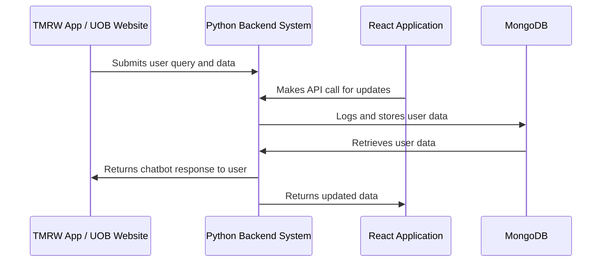

# Cross-Regional Customer Service Chatbot

A multilingual AI Chatbot that incorporates NLP to offer personalised customer service for banking clients across various regions. Once deployed, this chatbot will be able to operate 24/7 and service clients from anywhere around the globe. It is capable of handling matters ranging from routine inquiries to transaction assistance.

## Problem Statement

In today's globalized economy, banks face the challenge of providing consistent, high-quality customer service across multiple regions and languages, while managing the expectations of clients who demand instant, round-the-clock support. Traditional customer service models struggle to meet these demands due to limitations in human resources, operational hours, and language capabilities. This results in delays, communication barriers, and customer dissatisfaction. A multilingual AI chatbot addresses these issues by leveraging natural language processing (NLP) to deliver personalized, efficient, and scalable customer service, ensuring that clients receive timely assistance regardless of their location or language. This solution not only enhances customer experience but also reduces operational costs and improves service availability.

## Project Description

The Cross-Regional Customer Service Chatbot can be deployed and hosted on platforms such as UOB's TMRW mobile banking application and official website to provide personalized banking support to customers. Our chatbot incorporates an open-source large language model (LLM) that is capable of conversing in various languages. This enhances the overall user experience and opens up the possibility for more meaningful quality interactions.

In addition to its core functionality, a comprehensive dashboard has been developed to monitor and log the chatbot's performance that shapes the customer experience. Developed for administrative users, this dashboard enables real-time insights into customer interactions, helping banks optimize service delivery and continuous developments to the chatbot's effectiveness in delivering quality customer service.

## Project Overview

The following table highlights some of the key features in our project.

| Feature                      | Description                                                       | Status           |
| ---------------------------- | ----------------------------------------------------------------- | ---------------- |
| **User Authentication**      | Handles admin login and registration                              | Completed        |
| **Dashboard**                | Displays user data and analytics                                  | Completed        |
| **API Integration**          | Connects to third-party services                                  | Completed        |
| **Push Notification System** | Sends notifications based on user actions (e.g report / escalate) | Future Iteration |
| **Large Language Model**     | Improvement from traditional dialog flow interaction              | Completed        |

## Table of Contents

- [Technology Stack](#technology-stack)
- [UML Diagram](#uml-diagram)
- [Features](#features)
  - [Multilingual Support](#multilingual-support)
  - [Personalized Customer Service](#personalized-customer-service)
  - [Dashboard for Monitoring](#dashboard-for-monitoring)
- [Installation](#installation)
  - [Prerequisites](#prerequisites)
  - [Setup Instructions](#setup-instructions)
- [Usage](#usage)
  - [Using the Dashboard](#using-the-dashboard)
- [Authors](#authors)
- [License](#license)
- [Contact](#contact)

## Technology Stack

- **[Python](https://www.python.org)**: Chosen for its simplicity and powerful libraries, making it ideal for rapid development and handling complex computations.

- **[Flask API](https://flask.palletsprojects.com/en/latest/api/)**: Selected for its lightweight nature and flexibility, providing a simple yet powerful framework for building RESTful APIs.

- **[Ollama LLM](https://ollama.com)**: Utilized for its advanced natural language processing capabilities, enabling sophisticated language understanding and generation.

- **[ReactJS](https://react.dev)**: Preferred for its efficient rendering and component-based architecture, which simplifies the development of dynamic and interactive user interfaces.

- **[Bootstrap](https://getbootstrap.com)**: Used for its responsive design framework, allowing quick and easy styling of the application with a consistent look and feel.

- **[GitHub](https://pages.github.com)**: For hosting our web application and dashboard. GitHub's built-in version control system allows for collaborative development and tracking of changes, which is crucial as the project scales up in future use case.

| Technology  | Purpose                               |
| ----------- | ------------------------------------- |
| **React**   | Frontend Application                  |
| **Python**  | Backend System, LLM Model Fine-tuning |
| **Flask**   | API Calls                             |
| **MongoDB** | Database Management                   |

## UML Diagram



## Features

### Multilingual Support

The AI-powered chatbot is designed to provide seamless and efficient communication across a wide range of languages, ensuring inclusivity and accessibility for users from different linguistic backgrounds.

#### Language Detection

- The chatbot automatically detects the language in which a user is communicating. This is achieved via finetuning the LLM on a corpus of linguistic data (i.e capture the nuances of each language).

- Natural language processing (NLP) algorithms analyze the user input query and auto-tags the topic (e.g loans, investing, account creation etc) most relevant to the query for administrative insights and analytics.

#### Language Switching

- Users can switch languages during a conversation without restarting the session. The chatbot seamlessly transitions to the new language, maintaining the context of the conversation. This is particularly useful in multilingual regions or for users who are comfortable using multiple languages.

#### Fallback Mechanism

- In cases where the chatbot encounters text in a language that is not supported or poorly understood, it will provide a fallback response in a default language (e.g., English), and suggest ways for the user to continue the conversation (e.g., using a different language or contacting support).

- Acknowledging the possibilities of inaccurate response and language outputs due to limited model training, customers have the ability to escalate or report a response for adminstrative follow-ups. Such capabilities establishes an auto-feedback channel to facilitate iterative improvements to the overall service.

## Dashboard for Monitoring and Gauging Chatbot Performance

### General Analytics

| Feature                           | Description                                                                                              | Purpose                                                                                     |
| --------------------------------- | -------------------------------------------------------------------------------------------------------- | ------------------------------------------------------------------------------------------- |
| **Conversation History**          | Provides access to past conversations between customers and the chatbot.                                 | Enables agents to review previous interactions for context and follow-up.                   |
| **Multilingual Interaction Logs** | Logs and categorizes conversations based on the language used by the customer.                           | Facilitates analysis of language preferences and ensures multilingual support is effective. |
| **Data Export**                   | Provides options to export conversation logs and performance data in various formats (CSV, Excel, etc.). | Facilitates external analysis and reporting.                                                |
| **Alerts & Notifications**        | Sends real-time alerts for specific triggers (e.g., high-priority customers, unresolved issues).         | Ensures timely response to critical situations.                                             |

### Performance analytics

| Feature                             | Description                                                                        | Purpose                                                                                   |
| ----------------------------------- | ---------------------------------------------------------------------------------- | ----------------------------------------------------------------------------------------- |
| **Conversation-Resolution Metrics** | Displays ongoing customer conversations in real-time.                              | Allows customer service agents to monitor and intervene if needed.                        |
| **Sentiment Analysis**              | Analyzes the sentiment of customer messages (positive, neutral, negative).         | Helps agents understand customer emotions and prioritize responses.                       |
| **Performance Metrics**             | Shows key performance indicators (KPIs) such as response time and resolution rate. | Allows management to track chatbot efficiency and customer satisfaction.                  |
| **User Feedback Collection**        | Displays customer feedback and ratings on chatbot interactions.                    | Helps in evaluating customer satisfaction and refining the chatbot experience.            |
| **Issue Escalation Tracking**       | Tracks cases where conversations were escalated to human agents.                   | Monitors the chatbot's ability to handle queries and when human intervention is required. |

## Installation

### Prerequisites

Ensure that you have Java, Python, Pip and Node installed in your machine or environment. If not, please refer to the following reference website for details on the initial setup:

- [Python](https://www.python.org/downloads/) (Preferable version >= 3.10)
- [Node](https://nodejs.org/en/download/package-manager) (Preferable version >= 22.0.0)
- [Java](https://www.java.com/en/download/help/download_options.html) (Preferable version >= 17.0.0)
- [Pip](https://pip.pypa.io/en/stable/installation/) (Preferable version >= 24.0)

### Setup Instructions

Step 1: Set up a virtual environment for running the application locally (Skip this if you intend on using the deployed version)

```
# Check if Python version is available (e.g 3.10)
python3.10 --version

# Create the virtual environment
python3.10 -m venv my-virtual-env

# Activate the virtual environment
source myenv/bin/activate
```

Step 2: Python Dependencies
Use pip to install all requirements from the requirements.txt file (this will needed to run the functions import the libraries in the server.py file.

```
# Only run the following command once you have activated the virtual environment
pip3 install -r requirements.txt
```

Step 3: ReactJS Dependencies
To download all the modules for our dashboard, simply run the following command to install all the packages

```
npm install
```

## Usage

### Using the Dashboard

If the application is not deployed, you can perform the following actions to operate the dashboard in a local environment:

```
# Terminal 1: Running the dashboard
cd bot-admin-dashboard
npm start
```

```
# Terminal 2: Running the server
python3 server.py
```

## Authors

- [@KevinTan1203](https://github.com/KevinTan1203)

- [@user2](https://github.com/)

- [@gracierchua](https://github.com/gracierchua)

- [@taufikhazri](https://github.com/taufikhazri)

- [@germainelry](https://github.com/germainelry)
