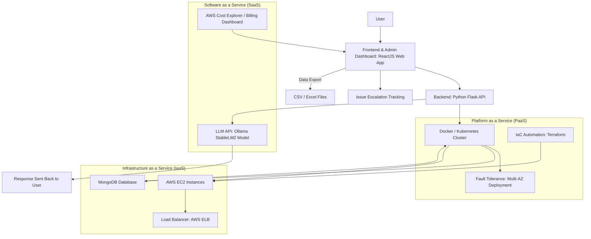

```mermaid
graph TD
 subgraph SaaS["Software as a Service (SaaS)"]
        D["LLM API: Ollama StableLM2 Model"]
        SaaS3["AWS Cost Explorer / Billing Dashboard"]
  end
 subgraph PaaS["Platform as a Service (PaaS)"]
        PaaS1["Docker / Kubernetes Cluster"]
        IaC1["IaC Automation: Terraform"]
        FTR["Fault Tolerance: Multi-AZ Deployment"]
  end
 subgraph IaaS["Infrastructure as a Service (IaaS)"]
        IaaS1["AWS EC2 Instances"]
        DB["MongoDB Database"]
        F["Load Balancer: AWS ELB"]
  end
    A["User"] --> B["Frontend & Admin Dashboard: ReactJS Web App"]
    B --> C["Backend: Python Flask API"] & Escalation["Issue Escalation Tracking"]
    C --> D & PaaS1
    D --> E["Response Sent Back to User"]
    PaaS1 --> FTR & DB & IaaS1
    DB --> PaaS1
    IaaS1 --> F
    SaaS3 --> B
    B -- Data Export --> Export["CSV / Excel Files"]
    IaC1 --> IaaS1
```
